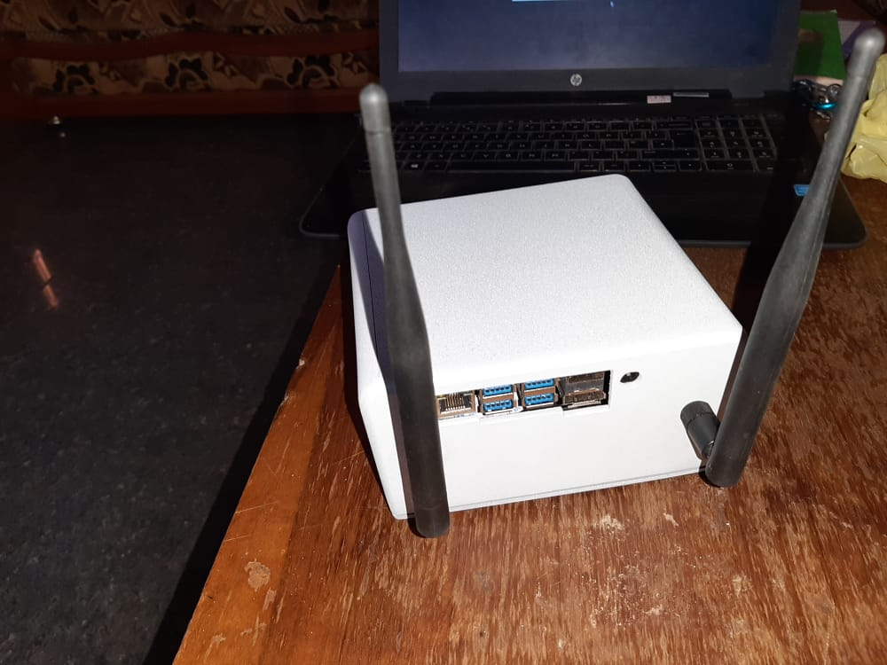
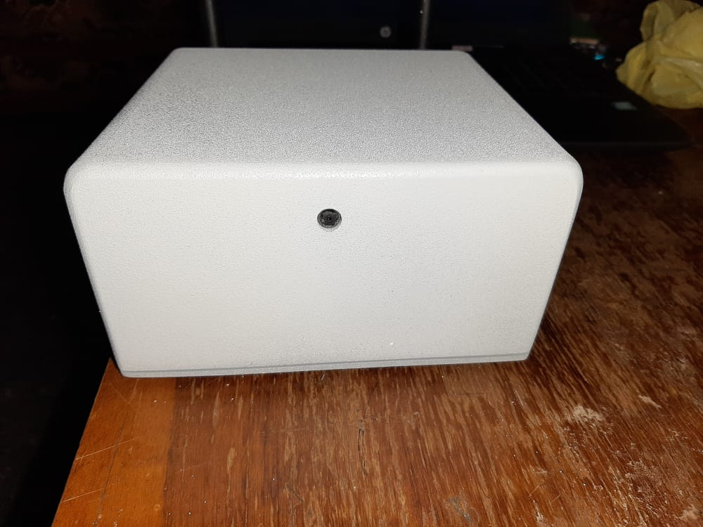
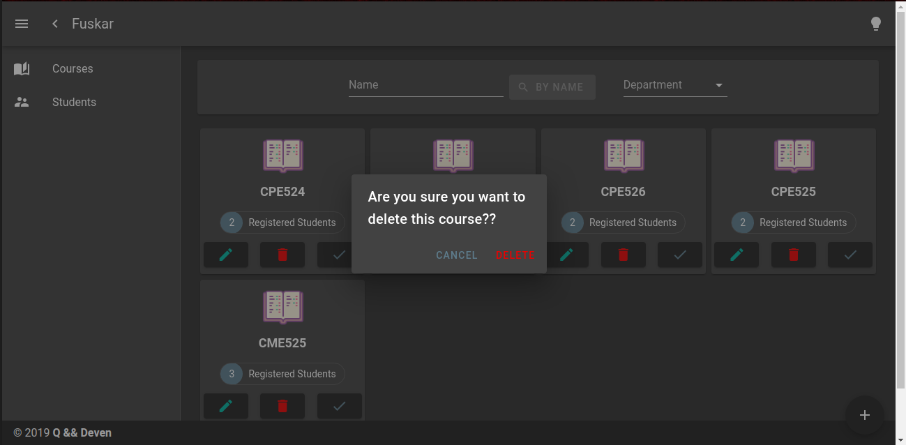
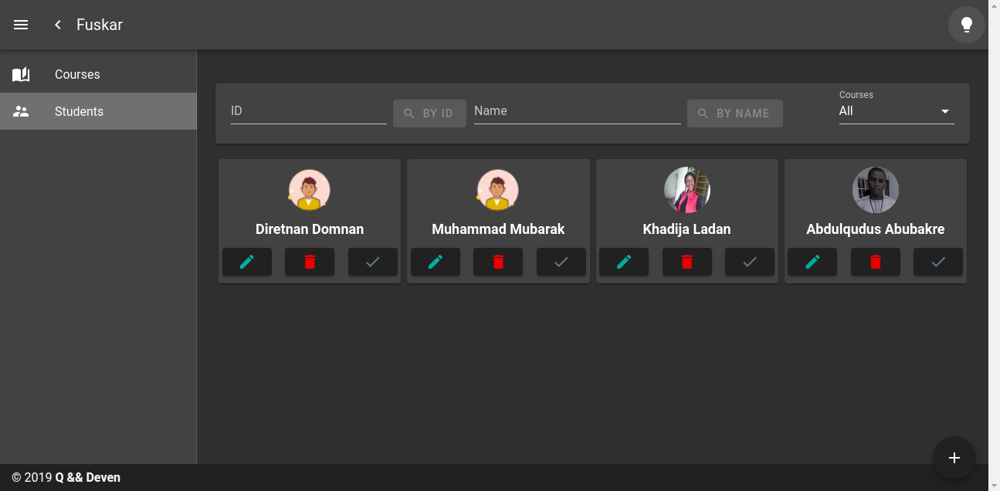

# Fuskar

This is a facial recognition application built to be deployed on an NVIDIA Jetson Nano
It combines the similarity comparison of the FaceNet Model trained on a Siamese network into a django API served to a VueJS frontend


## Development

### Backend

The API was built using django and face_recognition

```bash
    # install redis
    sudo apt-get install redis-server

    # create virtualenv
    mkvirtualenv fuskar
    # install requirements
    pip install -r backend/requirements.txt
    # create postgres database
    sudo su postgres -c "psql -c \"CREATE ROLE fuskar with password 'fuskar';\""
    sudo su postgres -c "psql -c \"CREATE DATABASE fuskardb with owner fuskar;\""
    sudo su postgres -c "psql -c \"ALTER ROLE fuskar WITH LOGIN;\""
    # change directory
    cd backend
    # run migrations
    python manage.py migrate
    # start server
    python manage.py runserver
```

### Frontend

The front end was built using nuxtjs, a progressive vuejs framework that supports server side rendering. Code [here](https://github.com/abdulqudus001/student-attendance)

## Build Setup

``` bash
# install dependencies
$ yarn install

# serve with hot reload at localhost:3000
$ yarn dev

# build for production and launch server
$ yarn build
$ yarn start

# generate static project
$ yarn generate
```

For detailed explanation on how things work, check out [Nuxt.js docs](https://nuxtjs.org).

## Usage

- Turn on the device shown below




- Use a laptop or phone to connect the device to the device hotspot with the password 'fuskar-owner'
- Visit the web application on 10.42.0.1




### Deploy Plans

- [x] Create endpoints for student registration and management

- [x] Create endpoints for course registration and management

- [x] Create asynchronous tasks for taking attendance and retraining pickled parameter

- [ ] Debug setup for huey where huey does not run tasks

- [ ] Complete NVIDIA jetson Nano setup to install dlib with gpu capabilities

- [ ] Auto start `wireless hotspot`

- [ ] Allow all incoming traffic on port 80 using ufw
 
- [ ] Create nginx sites-available script for redirecting traffic from port 80 to the front-end port

- Back-end (Django) application

    - [ ] Auto Switch camera to read from jetson nano streamer

    - [x] Create Daphne service file

    - [ ] Create Redis-server  broker service file

    - [x] Make sure to start Huey service before Daphne service

    - [x] Tie Huey service start to start Celery service

- Front-end (Vue) application

    - [x] Create Vue service file

    - [x] Connect to back-end port

    - [x] Crop whitespace out of captured image

    - [x] Create Vue server service file to run on start, depending on django service file

